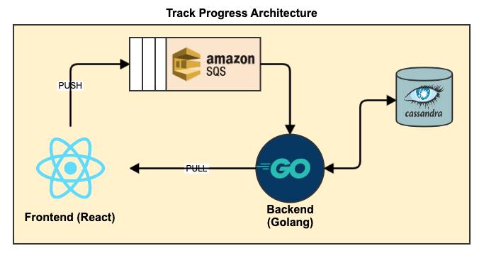

# track-progress
> A Trello like board built using Go

# Architecture


# Running
1. Build the images for the backend and frontend
```
make images
```
2. Start the services
```
docker-compose up -d
```

